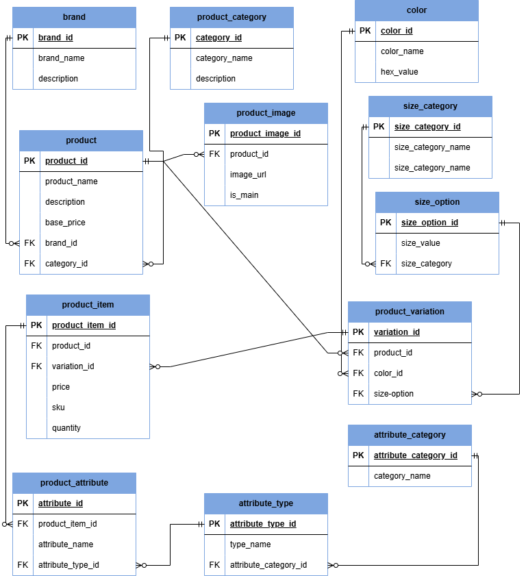

##  Ecommerce project.

## Contributers
    1. Duke Mochama-dukemochama@gmail.com
    2.
    3. 
    4.

## Instructions
  * Create an ERD
  * Plan the Dataflow

## Objectives
  1. Implement an Entity-Relationship Diagram (ERD).
  2. Collaboratively build an ecommerce database from scratch.
  3. Implement relationships between tables
  4. Identify primary keys, foreign keys, and other constraints.

## ERD

